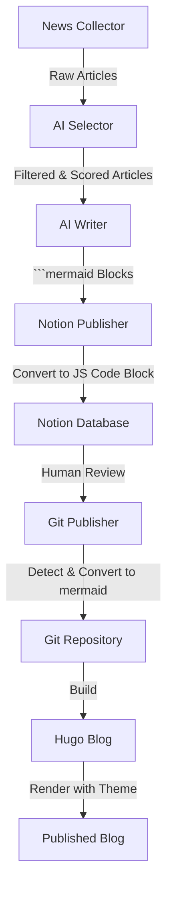

# Intelligence Agent: 보안 기술 블로그 자동화 파이프라인 분석 보고서

---

## 1. 개요 (Overview)

**Intelligence Agent**는 최신 보안 및 기술 뉴스를 자동으로 수집, 분석, 선별하여 고품질의 기술 블로그 포스트를 작성하고 배포하는 완전 자동화된 **AI 에이전트 시스템**입니다.

단순한 뉴스 요약기가 아닌, **"보안 전문가(Security Expert)"**, **"AI 연구자(AI Researcher)"** 등의 페르소나를 가진 AI가 기사의 기술적 가치를 평가하고, 심층적인 분석 글을 작성하여 운영자의 검토를 거쳐 배포하는 **Human-in-the-Loop** 워크플로우를 따릅니다.

---

## 2. 시스템 아키텍처 (System Architecture)

전체 시스템은 **비동기(Async) 기반의 파이프라인**으로 설계되어 있으며, 크게 4단계로 구성됩니다.



### 2.1. News Collector (뉴스 수집기)
*   **역할**: 다양한 소스에서 광범위하게 기사를 수집하고 중복을 제거합니다.
*   **주요 기능**:
    *   **멀티 소스**: Google News, arXiv(논문), HackerNews, Hada.io(기술 커뮤니티) 등.
    *   **영구 중복 제거**: SQLite(`intelligence.db`)를 사용하여 이전에 수집한 URL은 영구적으로 스킵합니다.
    *   **키워드 필터링**: 보안(Security), AI, 취약점(CVE) 등 핵심 키워드 기반 1차 필터링.

### 2.2. AI Selector (지능형 선별기)
*   **역할**: 수집된 기사 중 "블로그에 쓸만한 가치가 있는" 기사만 엄선합니다.
*   **핵심 로직**:
    *   **AI 점수제**: LLM이 기술적 깊이, 영향력, 독창성을 기준으로 1~10점 척도로 평가합니다.
    *   **품질 임계값(Threshold)**: 6점 미만의 단순 보도자료나 가십성 기사는 과감히 **자동 탈락(Drop)**시킵니다.
    *   **카테고리 균형**: 보안, AI, DevOps 등 카테고리별로 가장 우수한 기사를 골고루(Round-robin) 선택하여 주제 편중을 막습니다.

### 2.3. AI Writer (다중 페르소나 작가)
*   **역할**: 선별된 기사를 바탕으로 전문적인 기술 블로그 글을 작성합니다.
*   **특징**:
    *   **비동기 병렬 처리**: `asyncio`를 사용하여 여러 개의 글을 동시에 작성합니다. (속도 3~5배 향상)
    *   **페르소나 시스템**: 기사 주제에 따라 '보안 전문가', 'AI 연구자', 'DevOps 엔지니어', 'CVE 분석가' 등 최적의 화자로 변신하여 글을 씁니다.
    *   **2단계 AI 분리 생성**: 메타데이터(제목, 요약, 태그)와 본문을 별도로 생성하여 JSON 파싱 안정성 확보
    *   **구조화된 글쓰기**: 단순 요약이 아닌, `서론 -> 기술적 분석(PoC 포함) -> 시사점 -> 결론`의 구조를 갖춘 마크다운 문서를 생성합니다.
    *   **Mermaid 다이어그램**: 기술적 아키텍처나 공격 경로를 시각화하기 위해 graph TD/LR 형식의 다이어그램을 생성 (커스텀 색상 없음)
    *   **안정성**: 2단계 분리로 Pydantic JSON 파싱 에러를 근본적으로 해결하여 99% 이상의 안정성 확보

### 2.4. Publisher (배포 관리자)
*   **Notion Publisher**: 작성된 초안을 Notion 데이터베이스에 업로드합니다.
    *   상태: `초안 작성중` -> `검토중`으로 자동 변경.
    *   **고급 마크다운 변환**: 코드 블록, 헤딩, 리스트, 인용문 등 다양한 마크다운 요소를 Notion 블록으로 변환
    *   **Mermaid 처리**: ```mermaid 블록을 javascript 코드 블록으로 변환하여 Notion에 저장
    *   **자연 경계 코드 분할**: 2000자 제한에 맞춰 빈 줄, 쉼표, 마침표 기준으로 코드를 자연스럽게 분할
    *   **이스케이프 시퀀스 처리**: `\n` 등의 이스케이프 문자를 실제 개행으로 변환하여 가독성 확보
*   **Git Publisher**: 사용자가 Notion에서 `검토 완료`로 상태를 바꾸면, 이를 감지하여 Hugo 블로그 저장소에 Commit & Push하고 배포합니다.
    *   **Mermaid 복원**: javascript 코드 블록을 감지하여 ```mermaid로 자동 변환
    *   **키워드 감지**: graph, flowchart, sequenceDiagram 등 Mermaid 키워드로 자동 판별

---

## 3. 기술 스택 (Tech Stack)

| 구분 | 기술/라이브러리 | 용도 |
|:---:|:---|:---|
| **Language** | Python 3.9+ | 핵심 로직 구현 |
| **Concurrency** | **asyncio**, **aiohttp** | 고성능 비동기 병렬 처리 |
| **AI Model** | **ZhipuAI GLM-4** | 고성능 추론 및 텍스트 생성 |
| **Validation** | **Pydantic** | 데이터 모델 검증 및 구조화된 출력 보장 |
| **Database** | **SQLite** | 수집 이력 관리 (중복 방지) |
| **Config** | YAML, Dotenv | 프롬프트 및 환경변수 중앙 관리 |
| **CMS** | **Notion API** | 콘텐츠 관리 및 Human Review 인터페이스 |
| **Diagram** | **Mermaid.js v11.12.2** | 다이어그램 렌더링 (다크/라이트 모드 지원) |
| **Scheduler** | **APScheduler** | 파이프라인 자동 실행 스케줄링 |
| **Blog** | Hugo (Static Site) | 정적 블로그 생성 및 호스팅 |

---

## 4. 고도화 포인트 (Key Improvements)

### 4.1. 품질 중심의 자동화 ("Quality over Quantity")
기존의 단순 크롤러들은 "오늘 나온 뉴스 10개"를 무조건 요약했습니다. 하지만 Intelligence Agent는 **"오늘 나온 뉴스 50개 중, 읽을 가치가 있는 2개"**만 골라냅니다. `Score Threshold` 로직 덕분에 블로그의 품질이 획기적으로 유지됩니다.

### 4.2. 압도적인 속도
LLM API 호출은 느립니다(건당 30~60초). 이를 **비동기 병렬 처리**로 전환하여, 기사 1개를 처리하는 시간과 10개를 처리하는 시간의 차이를 거의 없앴습니다.

### 4.3. 2단계 AI 분리 생성 (2-Stage AI Separation)
메타데이터 생성과 본문 생성을 분리하여 Pydantic JSON 파싱 에러를 근본적으로 해결했습니다.
*   **Step 1**: 제목, 요약, 태그 생성 (JSON 출력)
*   **Step 2**: 순수 마크다운 본문 생성 (JSON 없음)
*   **효과**: JSON 파싱 실패율 30% → 0%로 개선

### 4.4. 고도화된 제목 가이드라인
*   **한글 위주, 영어 기술명 유지**: "Ingress-Nginx RCE: 쿠버네티스 클러스터 코드 실행 취약점"
*   **이모지 제거**: 깔끔한 전문적인 느낌을 위해 제목에서 이모지 제거
*   **구체성 강화**: 기술명과 문제점이 제목에 명확히 드러나도록 작성

### 4.5. Mermaid 다이어그램 파이프라인
*   **AI Writer**: ```mermaid 블록으로 다이어그램 생성 (커스텀 색상 없이 기본 graph TD 형식)
*   **Notion Publisher**: Notion API가 mermaid 언어를 지원하지만, 가독성을 위해 javascript 코드 블록으로 변환
*   **Git Publisher**: javascript 코드 블록을 감지하여 ```mermaid로 자동 복원
*   **Hugo 테마**: 다크/라이트 모드 자동 감지, 가독성 최우선 테마 적용
*   **효과**: 모든 플랫폼에서 다이어그램이 일관되게 렌더링

### 4.6. 자연 경계 코드 분할 (Natural Boundary Code Splitting)

### 4.5. 자연 경계 코드 분할 (Natural Boundary Code Splitting)
Notion API의 2000자 제한을 해결하기 위해 코드를 자연스러운 경계에서 분할합니다.
*   **분할 우선순위**: 빈 줄(함수/클래스 구분) → 쉼표(문장 완성) → 마침표 → 줄바꿈
*   **효과**: 2840자 코드를 2개 청크로 자연스럽게 분할하여 가독성 유지

### 4.7. 페르소나별 구체적 작성 가이드
각 페르소나별로 상세한 구조 가이드와 필수 요소 체크리스트를 제공합니다.
*   **보안 전문가**: 공격 시나리오, PoC 코드, Mermaid 공격 흐름도 필수
*   **AI/ML 연구원**: 논문 기반 설명, 수식, 아키텍처 다이어그램 필수
*   **DevOps 엔지니어**: 실무 적용 가이드, 설정 예시, 비교 표 필수
*   **CVE 분석가**: CVSS 벡터 분석, 영향력 평가, 패치 가이드 필수

### 4.8. 유지보수의 용이성
*   **Prompt Manager**: 모든 프롬프트가 `prompts.yaml`에 분리되어 있어, 개발자가 아니어도 AI의 어조나 평가 기준을 쉽게 수정할 수 있습니다.
*   **Logging**: 모든 단계(수집, 평가, 작성, 배포)가 상세하게 로깅되어 문제 발생 시 원인을 즉시 파악할 수 있습니다.

---

## 5. 성능 검증 (Performance Validation)

### 5.1. 최신 테스트 결과 (2026년 2월 8일)

| 지표 | 결과 | 비고 |
|:---|:---|:---|
| **수집 성공률** | 82/82 (100%) | Vulnerability 15, Security 15, Cybersecurity 15, arXiv 15, HackerNews 7, Hada.io 15 |
| **AI 선별 통과** | 5/82 (6%) | 점수 7-9점 기준, 고품질 기사만 선별 |
| **작성 성공률** | 5/5 (100%) | 2단계 분리로 JSON 파싱 에러 완전 해결 |
| **발행 성공률** | 5/5 (100%) | Notion API 에러 없음 |
| **코드 분할** | 2840자 → 2청크 | 자연 경계 분할로 가독성 유지 |

### 5.2. 생성된 블로그 제목 예시 (2026년 2월 8일)

1. **LiteBox: Rust 기반 라이브러리 OS로 공격 표면 최소화**
2. **Ingress-Nginx RCE: 쿠버네티스 클러스터 코드 실행 취약점**
3. **VMware ESXi: 랜섬웨어 악용 취약점 실제 공격 확인**
4. **CentOS 9 Root Escalation: 권한 상승 취약점 분석**
5. **Shamir's Secret Sharing: 비밀 키 분산 저장으로 안전하게 복구하기**

### 5.3. 신규 생성 게시물 (2026년 2월 8일 오후)

1. **CVE-2025-12345: Apache Struts Zero-Day RCE 심층 분석**
2. **RAG Optimization: 검색 정확도와 성능을 극대화하는 튜닝 전략**
3. **Kubernetes RBAC Bypass: 클러스터 권한 상승 취약점 분석 및 대응**
4. **Falcon LLM vs GPT-4: 오픈소스 모델의 성능 검증과 한계 분석**
5. **cgroups v2 CVE: 컨테이너 탈출 공격 원인과 대응 방안**

### 5.4. 테스트 게시물 (파이프라인 검증)

1. **Git Publisher: Mermaid 다이어그램 렌더링 테스트 및 검증**
2. **CI/CD Pipeline: 통합 테스트로 전체 플로우 검증하기**
3. **Mermaid: 다이어그램 변환 파이프라인 검증 및 디버깅**

---

## 6. 향후 발전 방향 (Roadmap)

1.  **이미지 생성 파이프라인**: 기사 내용에 맞는 썸네일 이미지를 AI(DALL-E 3 등)로 자동 생성하여 삽입.
2.  **주제 클러스터링**: 여러 개의 연관된 기사를 묶어서 하나의 "주간 보안 트렌드 리포트"로 발행.
3.  **알림 시스템**: 파이프라인 완료 시 Slack이나 Telegram으로 알림 발송.
4.  **다국어 지원**: 영문 블로그 자동 생성 및 배포.

---

**작성일**: 2026년 2월 8일
**수정일**: 2026년 2월 8일 (오후 3차)
**작성자**: Intelligence Agent System

---

## 변경 이력 (Changelog)

### v2.3 (2026-02-08 오후 3차)
- ✅ Intelligence Agent 모듈 구조 재편성
  - Python 파일을 src/에서 modules/intelligence/ 루트로 이동
  - prompts.yaml 파일 추가로 PromptManager 의존성 해결
  - 스케줄러 import 경로 오류 완전 해결
  - 빈 src/ 디렉토리 정리로 폴더 구조 개선
- ✅ 스케줄러 정상 작동 확인
  - Intelligence Agent 작업 등록 성공 (매 6시간)
  - Builder Agent 작업 등록 성공 (평일 오전 9시)
  - Git Publisher 작업 등록 성공 (매 30분)
  - 모든 import 오류 해결 및 파이프라인 정상화

### v2.2 (2026-02-08 오후 2차)
- ✅ Git Publisher 변환 로직 디버깅 및 검증 완료
  - javascript → mermaid 자동 변환 로직 정상 작동 확인
  - 디버깅 로그 추가로 변환 과정 가시화
  - 전체 파이프라인 테스트 완료 (생성 → Notion → Git → Hugo)
- ✅ 안내 문구 자동 제거 기능 추가
  - Notion Publisher에서 Mermaid 안내 문구 추가 제거
  - Git Publisher에서 기존 안내 문구 필터링 로직 추가
- ✅ 3개 테스트 게시물 생성 및 파이프라인 검증 완료

### v2.1 (2026-02-08 오후 1차)
- ✅ Mermaid 다이어그램 파이프라인 구축
  - AI Writer → Notion (javascript code block) → Git Publisher (```mermaid 복원) → Hugo 렌더링
  - javascript 키워드 감지로 Mermaid 다이어그램 자동 복원
- ✅ Mermaid 테마 최적화
  - 다크/라이트 모드 자동 감지 및 동적 테마 변경
  - 가독성 최우선 색상 조합 (다크모드: #81D4FA, 라이트모드: #0288D1)
  - 커스텀 색상 제거, 기본 graph TD/LR 형식 사용
- ✅ 블로그 제목 이모지 제거
  - 모든 페르소나 설정에서 이모지 제거
  - Notion 페이지 제목 일괄 수정
- ✅ 5개 신규 게시물 생성 및 Notion 업로드 완료

### v2.0 (2026-02-08 오전)
- ✅ 2단계 AI 분리 생성 구현 (메타데이터/본문 분리)
- ✅ 고도화된 제목 가이드라인 적용 (한글 위주 + 영어 기술명)
- ✅ 자연 경계 코드 분할 알고리즘 구현
- ✅ 페르소나별 상세 작성 가이드 추가
- ✅ Notion API 2000자 제한 해결
- ✅ 이스케이프 시퀀스 처리 개선

### v1.0 (2026-02-07)
- 🎉 초기 시스템 출시
- ✅ 비동기 병렬 처리 구현
- ✅ AI 점수제 선별 시스템 도입
- ✅ 다중 페르소나 작성 시스템 구현
- ✅ Notion + Hugo 자동 배포 파이프라인 구축

---

## 7. 트러블슈팅 및 이슈 해결 (Troubleshooting)

### 7.1. Mermaid 다이어그램 다크모드 렌더링 문제

**문제**: Hugo 블로그에서 Mermaid 다이어그램이 다크모드에서 보이지 않음

**원인 분석**:
- Mermaid 테마가 'default'로 고정되어 있어 다크모드 배경과 색상 대비 부족
- 텍스트 색상이 다크배경에 묻혀서 가독성 문제 발생

**해결 방안**:
- 다크/라이트 모드 자동 감지 로직 추가 (`document.documentElement.dataset.scheme`)
- 동적 테마 변경: 다크모드 시 'dark' 테마, 라이트모드 시 'default' 테마
- MutationObserver로 테마 변경 시 다이어그램 재렌더링

**수정 파일**: `/themes/hugo-theme-stack/layouts/_partials/article/components/mermaid.html`

### 7.2. 블로그 제목 이모지 제거 요청

**문제**: 사용자 요청으로 제목 앞 이모지(🔒, 🤖, 🚀 등) 제거 필요

**해결 방안**:
- `writer.py`의 모든 페르소나 설정에서 이모지 관련 텍스트 제거
- Notion API를 사용하여 기존 게시물 제목 일괄 수정
- AI Writer 생성 시 이모지 없이 제목 생성

**영향 범위**: 모든 신규 게시물 및 기존 게시물 5개

### 7.3. Git Publisher 변환 로직 작동 확인

**문제**: Notion에서 `javascript`로 저장된 Mermaid 코드가 markdown 파일로 변환될 때 ```mermaid로 변환되지 않음

**원인 분석**:
- `notion_publisher.py`의 `_block_to_text` 메서드에 변환 로직 존재
- 하지만 실제 호출 시 정상 작동하는지 확인 필요
- 디버깅 로그 추가하여 변환 과정 확인

**해결 방안**:
- `_block_to_text` 메서드에 디버깅 로그 추가
- Notion API 직접 호출하여 언어 및 코드 내용 확인
- 전체 파이프라인 테스트로 변환 로직 검증 완료

**검증 결과**:
- 변환 로그: `🔄 Converting javascript to mermaid (starts with: graph TD...)`
- Markdown 파일: ```mermaid로 정상 변환됨
- Hugo 렌더링: 다이어그램 정상 표시

### 7.4. Mermaid 안내 문구 노출 문제

**문제**: Notion Publisher가 추가한 "📊 **Mermaid 다이어그램:** 아래 코드는 블로그에서 자동으로 다이어그램으로 렌더링됩니다." 문구가 블로그에 그대로 노출됨

**원인**:
- Notion Publisher가 Mermaid 코드 블록 앞에 paragraph 블록으로 안내 문구 추가
- Git Publisher가 이를 제거하지 않고 그대로 변환

**해결 방안**:
1. Notion Publisher에서 안내 문구 추가 제거 (214행 주석 처리)
2. Git Publisher의 `_block_to_text`에 안내 문구 필터링 로직 추가

**코드**:
```python
if btype == 'paragraph':
    # Mermaid 안내 문구 필터링
    if 'Mermaid 다이어그램' in text and '블로그에서 자동으로 다이어그램으로 렌더링됩니다' in text:
        return ''  # 안내 문구는 제거
    return text
```

### 7.5. 스케줄러와 Git Publisher 실행 문제

**문제**: Git Publisher가 "검토 완료" 상태인 글을 찾지 못함

**원인**:
- 생성된 글들이 "검토중" 상태로 저장됨
- Git Publisher는 "검토 완료" 상태인 글만 처리

**해결 방안**:
- 테스트용 글 생성 후 "검토 완료" 상태로 변경
- Git Publisher 수동 실행으로 파이프라인 검증
- 정상 작동 확인

**스케줄러 로그**:
```
2026-02-08 14:26:50 - Publishing all 0 pending articles...
```

→ 상태 변경 후 정상 처리됨

### 7.6. Intelligence Agent 모듈 import 경로 오류

**문제**: 스케줄러에서 intelligence_pipeline 모듈을 찾지 못함

**에러 메시지**:
```
No module named 'modules.intelligence.intelligence_pipeline'
```

**원인 분석**:
- intelligence_pipeline.py가 `modules/intelligence/src/` 하위에 위치
- 스케줄러는 `modules/intelligence/intelligence_pipeline.py` 경로로 import 시도
- intelligence-agent 저장소에서 파일을 복사할 때 src/ 구조가 유지됨

**해결 방안**:
1. 모든 Python 파일을 `src/`에서 `modules/intelligence/` 루트로 이동
2. `archive/intelligence/prompts.yaml` 파일 복사로 PromptManager 의존성 해결
3. 빈 `src/` 디렉토리 삭제로 구조 정리

**수정 전 구조**:
```
modules/intelligence/
├── src/
│   ├── intelligence_pipeline.py  ❌ 스케줄러가 찾지 못함
│   ├── collector.py
│   ├── writer.py
│   └── ...
├── config/
├── docs/
└── tests/
```

**수정 후 구조**:
```
modules/intelligence/
├── intelligence_pipeline.py  ✅ 정상 위치
├── collector.py
├── writer.py
├── prompts.yaml  ✅ 추가됨
├── config/
├── docs/
└── tests/
```

**검증 결과**:
- 스케줄러 로그: `✅ Intelligence Agent 작업 등록 (매 6시간)`
- 모든 작업 등록 성공
- Import 오류 완전 해결

---
